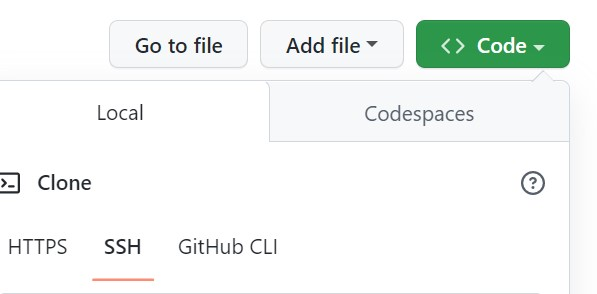

# Daily-Planner
## Project Description
This project is about office hour daily planner agenda. It stores hourly input tasks for the day and save to local storage. 
The office hour period is stored between 09:00 and 17:00 on a 24 hour clock.

## How it Works
On Page load, the current date is displayed with time blocks. The time blocks are color coded.

 * Grey time block grid(s) displays the hour(s) is in the past. 
 * Red time block grid displays the present hour. 
 * Green time block grid(s) displays the hour(s) is in the future.

Text can be added to each hour time block and click the save button, it stores the value(S) in the local storage,  and also persist the value(S) on page refresh. 

## How to run project on local machine
* Install Visual Studio Code
* Navigate to main page of the git Repository
* Click on the 'Code'
* Copy the SSH line to run on the Terminal or  the HTTPS link
* Clone the repository - 

## links
#### Deployed Url: [Daily Planner]().

## Web Page Screenshots

 

## Contribute
If you want to learn more about git clone. you can seek inspiration from the below:
#### External files
[Github Docs](https://docs.github.com/en/repositories)
[W3schools](https://www.w3schools.com/js/default.asp)
